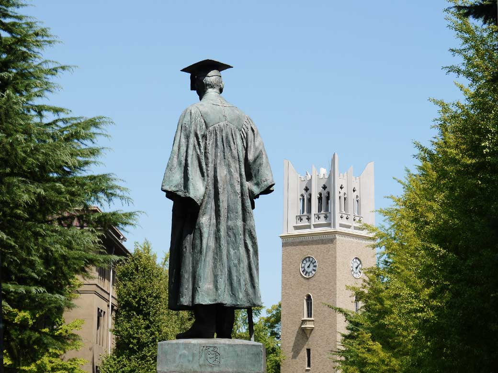
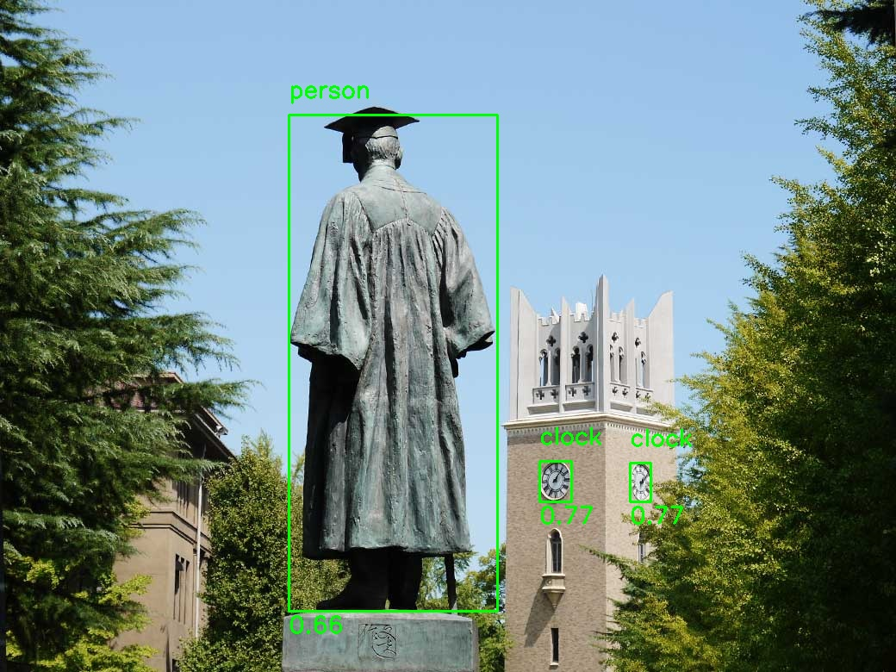
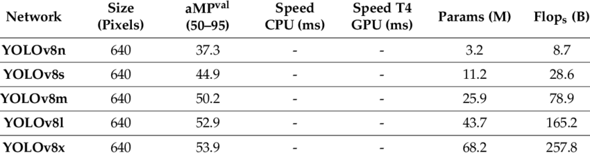

### 深層学習/DeepLearning基礎講座2026 レポート課題 Day1
<div style="text-align:right;">
早稲田大学菅野研究室修士1年 益田隆太郎

2026/4/11
</div>

### 1. やったこと・動かしたものの概要

YOLOv8nとYOLOv8sを用いて1枚の画像に対して画像認識を行い，オブジェクトを認識してそのオブジェクト名と信頼度を画像出力することでその精度を比較した．使用した画像は以下である．



図1. 比較に使用した画像(大隈重信像と大隈講堂)

| 項目 | バージョン |
|------|-----------|
| OS | Windows 11 |
| Python | 3.12.3 |
| ultralytics | 8.4.37 |
| OpenCV | 4.13.0.92 |

表1. 動作環境

### 2. 具体的な手続き

YOLO(YouOnlyLookOnce)パッケージを用いて，pythonで以下のコードを実行した．コードはYOLOとPythonで始める物体検出入門[1]を参考にして作成した．
GitHubリポジトリは[こちら](https://github.com/RyutaroMasuda/matsuo_dl_2026)

```python

from ultralytics import YOLO
import cv2
import numpy as np
import argparse

parser = argparse.ArgumentParser(description='YOLOのデモ')
parser.add_argument('--yolo_version', type=str, help='sかnのどちらかの数字を指定',default='s')

args = parser.parse_args()
if args.yolo_version == 's':
    model_path = 'yolov8s.pt'
elif args.yolo_version == 'n':
    model_path = 'yolov8n.pt'
else:
    raise ValueError("yolo_versionはsかnを指定のこと")

def load_yolo_model(model_path=model_path):
    model = YOLO(model_path)
    return model

def detect_objects_in_image(model, image_path):
    results = model(image_path)
    return results

def visualize_results(image_path, results):
    img = cv2.imread(image_path)
    for r in results:
        boxes = r.boxes
        for box in boxes:
            x1, y1, x2, y2 = box.xyxy[0]
            cls_id = int(box.cls[0])
            cls_name = model.names[cls_id]          # クラス名を取得
            conf = float(box.conf[0])               # 信頼度を取得
            label = f"{cls_name} {conf:.2f}"        # 例: "person 0.87"
            cv2.rectangle(img, (int(x1), int(y1)), (int(x2), int(y2)), (0, 255, 0), 2)
            cv2.putText(img, cls_name, (int(x1), int(y1) - 20),   # クラス名：ボックス上
                        cv2.FONT_HERSHEY_SIMPLEX, 0.9, (0, 255, 0), 2)
            cv2.putText(img, f"{conf:.2f}", (int(x1), int(y2) + 25),  # 信頼度：ボックス下
                        cv2.FONT_HERSHEY_SIMPLEX, 0.9, (0, 255, 0), 2)
    
    cv2.imshow('Result', img)
    cv2.imwrite(f'output_yolov8{args.yolo_version}.jpg', img)
    cv2.waitKey(0)
    cv2.destroyAllWindows()

# modelのロード
model = load_yolo_model()
print(f"モデルがロードされました: {model}")

# オブジェクトの個数検出
image_path = './class1/statue_auditorium_eyecatch.jpg'
results = detect_objects_in_image(model, image_path)
print(f"検出された物体: {len(results[0].boxes)} 個")

# 可視化
visualize_results(image_path, results)
```
実行コード
```
uv run .\class1\kadai1.py --yolo_version s
uv run .\class1\kadai1.py --yolo_version n
```
結果，以下の画像を得た．


図2. YOLOv8n出力画像



図3. YOLOv8s出力画像

### 3. わかったこと・わからなかったこと

以下はYOLOv8の各重みの比較表[2]である．

表2. YOLOv8の各重みの比較[2]

- mAP valは検証データでの物体検出精度であり，0～100の値で高いほど精度が良い．つまり，YOLOv8nとYOLOv8sを比べると37.3と44.9とで7.6ポイントの差がある．また，Flopsは1枚の画像を推論する際の演算回数であり，YOLOv8sの方が約3倍大きい．そして，Paramsはモデルのパラメータ数で，大きいほどモデルが複雑で精度が上がりやすいが，メモリ消費も増える．
- 実際，図2と図3を比較するとYOLOv8nでは時計台の時計を1つしか認識できなかったのに対し，YOLOv8sは2つとも認識することができており，比較表のとおりYOLOv8sの方が高い精度を持つことが分かった．
- 処理速度が実行時に標準出力された．その差はYOLOv8sが77.5msだったのに対し，YOLOv8nは40.2msで，YOLOv8nの方が早かったが，画像1枚ではその処理速度の差は体感できなかった．
- 信頼度の閾値の設定方法など，YOLOの具体的な使い方については分からなかった．これからYOLOを使用していく中で勉強したいと思う．

### 4. 参考文献

- [1][YOLOとPythonで始める物体検出入門](https://qiita.com/automation2025/items/478055cb632cb02bff75)
- [2]Jocher, G.; Chaurasia, A.; Qiu, J. Ultralytics YOLO; Version 8.0.0; Ultralytics: Los Angeles, CA, USA, 2023. Available online:
https://github.com/ultralytics/ultralytics (accessed on 11 April 2026).